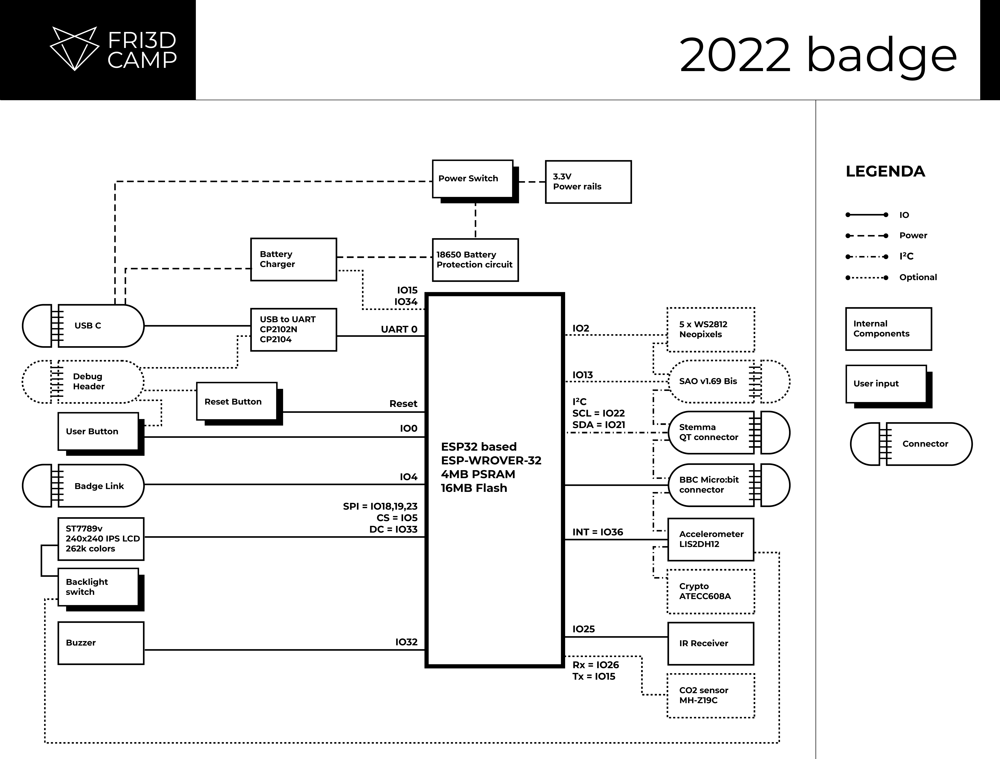
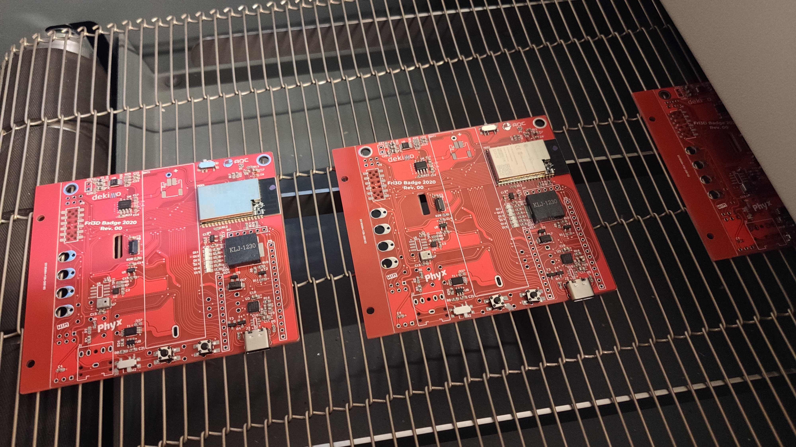
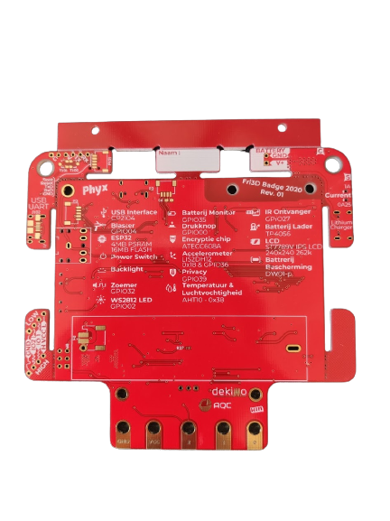
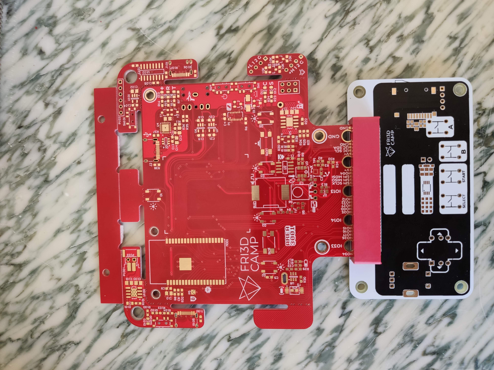
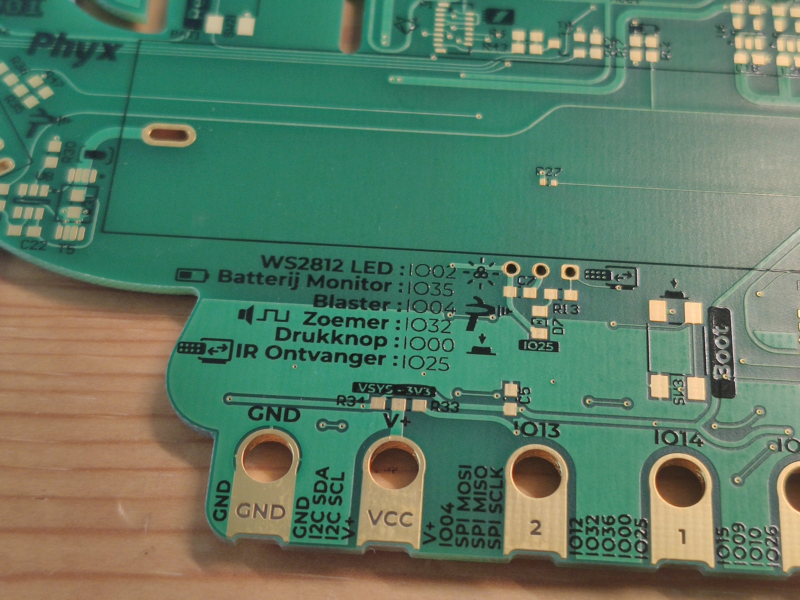
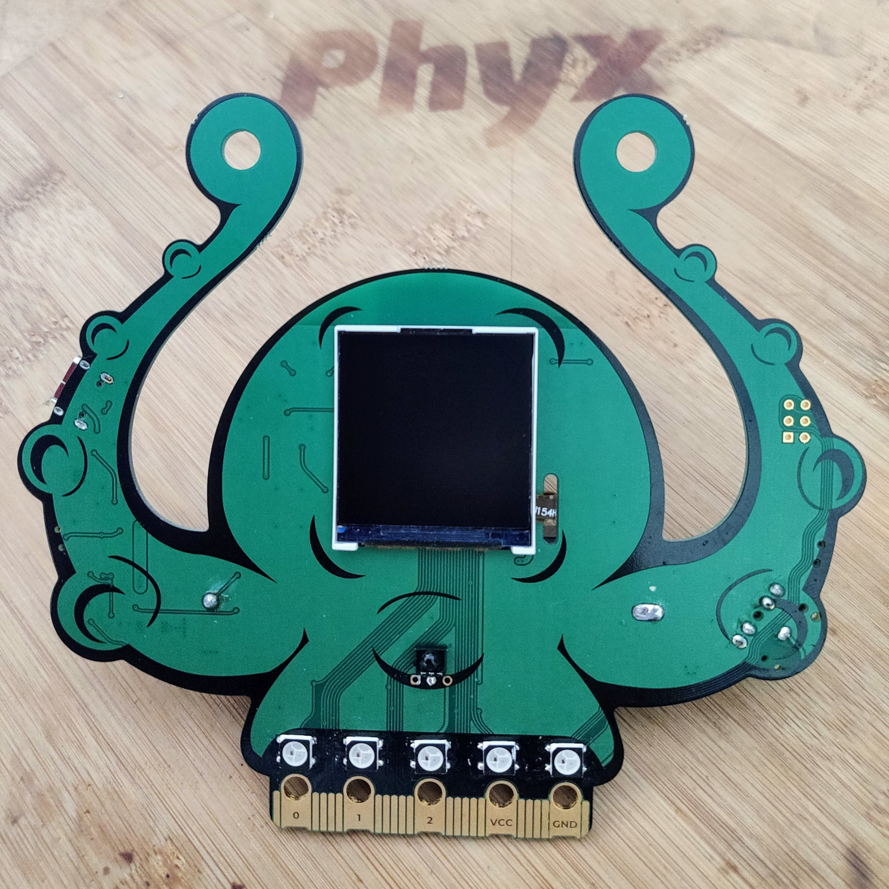
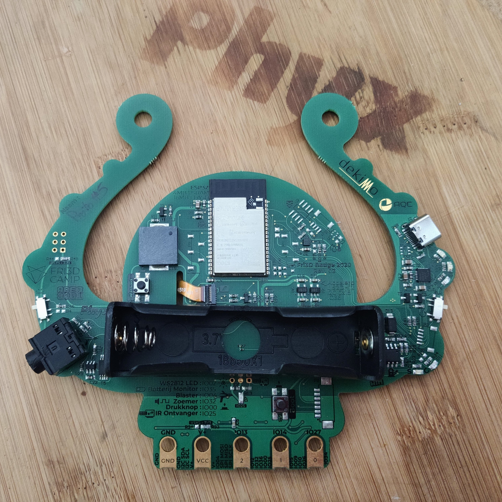
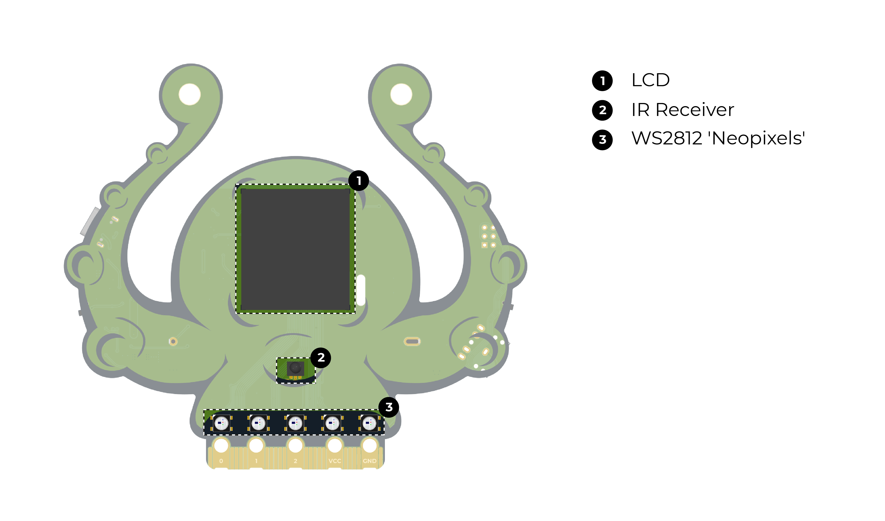
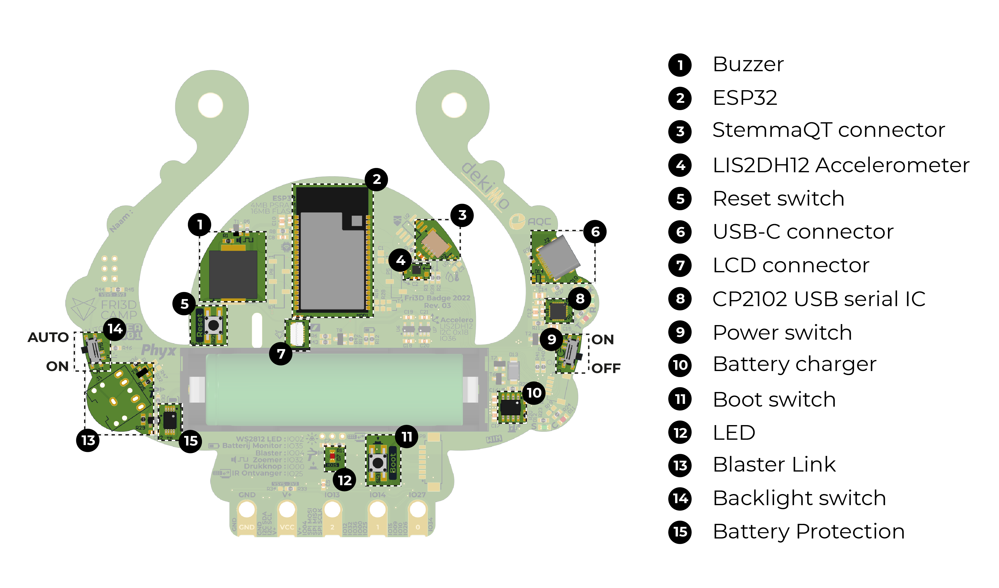

# Fri3d Badge 2020

This repository contains the hardware design of the [Fri3d Camp](https://fri3d.be/) badge for 2020 / 2022. The project progress can be followed on our [Hackaday.io](https://hackaday.io/project/169741-fri3d-2022-badge) page.

## Blockdiagram

In order to make the documentation easier to use, we've added the block diagram in this repository.

## REV 00
First prototype to verify the schematic design.

## REV 01
Moved away from the Adafruit Feather compatible expansion header in favor for the [BBC micro:bit expansion connector](https://tech.microbit.org/hardware/edgeconnector/)

Test fit of the badge with the first protoype of the [GameOn](https://github.com/Fri3dCamp/gameon-2020)

## REV 02
Upgraded the micro:bit connector to V2 shape.
This board has the final shape for the badge and has a green soldermask with black silkscreen.

## REV 03
The production version of the badge with improvements in the BadgeLink circuit and a change in the LCD backlight button operation. Now the slide switch will either turn the display backlight ON or render it's control to the interrupt pin from the accelerometer allowing for wakeup based on movement for increased battery savings.

## Documentation
In the "media" folder we've added the small infosheet leaflet that's included with the badge as well as the presentation that was given bij Wim Van Gool during the event.

## Hackability

As highlighted in the presentation, the badge has some expansion possibilities.

### CO2 sensor

With the help of P5 and P8 SMD headers [61000413321, 61000513321]( https://www.we-online.com/catalog/en/PHD_2_54_SMT_SOCKET_HEADER_6100XXXXX21) and a 10µF 0805 capacitor, you can add the [MH-Z19C sensor]( https://www.reichelt.com/be/nl/infrarood-co2-sensor-mh-z19c-pin-header-rm-2-54-co2-mh-z19c-ph-p297320.html). Alternatively, there is also room for the [Molex 
53261-0771](https://www.molex.com/molex/products/part-detail/pcb_headers/0532610771) SMD connector so you can use the [wire mounted variant of the MH-Z19C]( https://www.tinytronics.nl/shop/en/sensors/air/gas/winsen-mh-z19c-co2-sensor-with-cable)
Note that this sensor will only work ate 5V so USB power is required.

### Battery Charger Control

By mounting R18 and R19 with a 100Ω you gain battery charging control. This will allow to read the charger status on GPIO34 and control whether or not the battery should be charging using GPIO15.

### Temperature and Humidity sensor

The [Wurth 2525020210001]( https://www.we-online.com/catalog/en/WSEN-HIDS) temperature and humidity sensor can be mounted on the U3 footprint along with a 100nF 0603 capacitor on C3 for local decoupling. 
